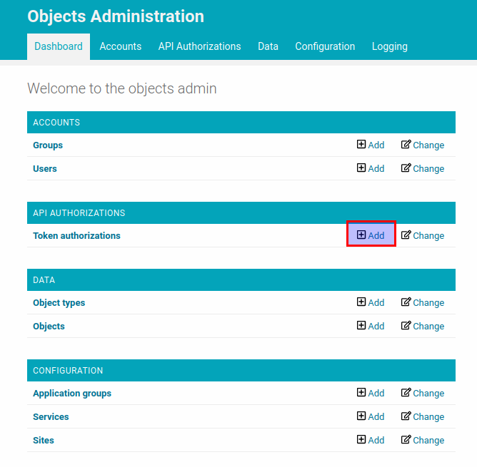
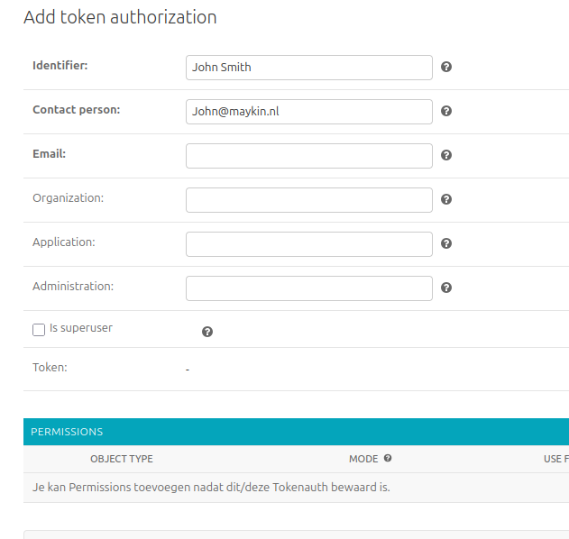

.. _admin_authentication:

==============
Authentication
==============

Both the Objecttypes API and the Objects API support token authentication (or bearer
authentication), which means that everyone who has the security token can access the API.
Tokens are configured in the admin.

In this section we will create a security token for Open Objecten and use it in
the HTTP request.

In the admin of the Objects API click on the "add" button for "Token authorizations"
resource.

The "Permissions" section is used for authorizations and can be left empty for now.
It's described in the :ref:`admin_authorization` section of this document.

After the form is filled in and submitted the token would be created. The token
itself is a sequence of 40 letters and digits. It's value is generated automatically
when the form is submitted. In this example we will use ``5678`` as a token value.

Now we can use the created token to request the Objects API. The token should be
included into "Authorization" header: ``Authorization: Token 5678``

.. code-block:: http

    GET /api/v1/objects HTTP/1.1
    Authorization: Token 5678

    HTTP/1.1 200 OK

    []

If you want to know how to use Objects API you can follow :ref:`api_usage`

Now you can configure :ref:`admin_authorization` for the Objects API.
