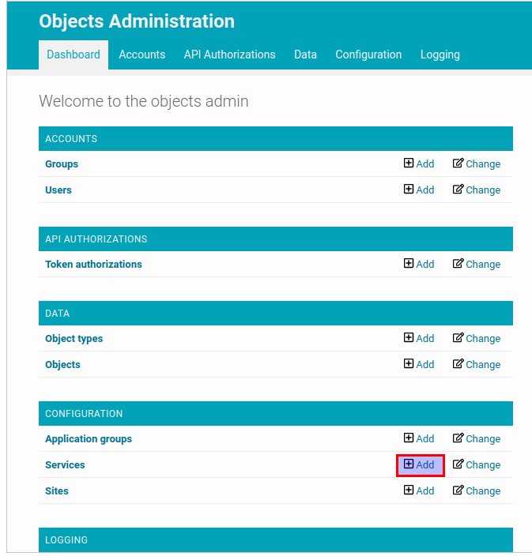
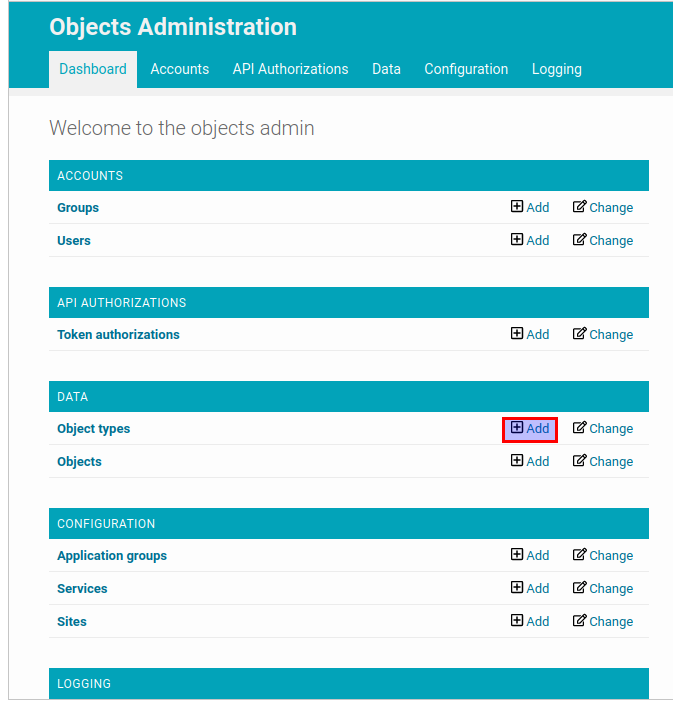
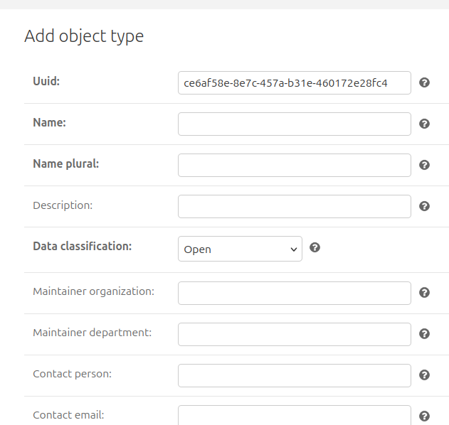
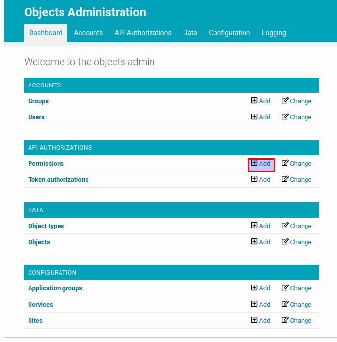
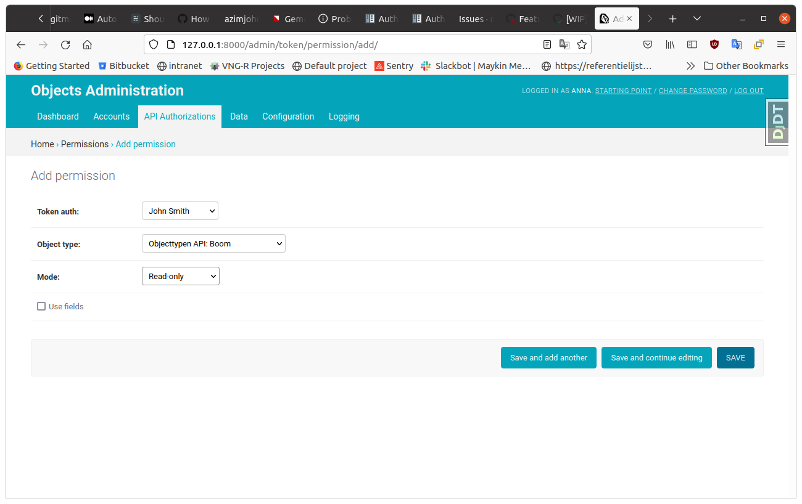
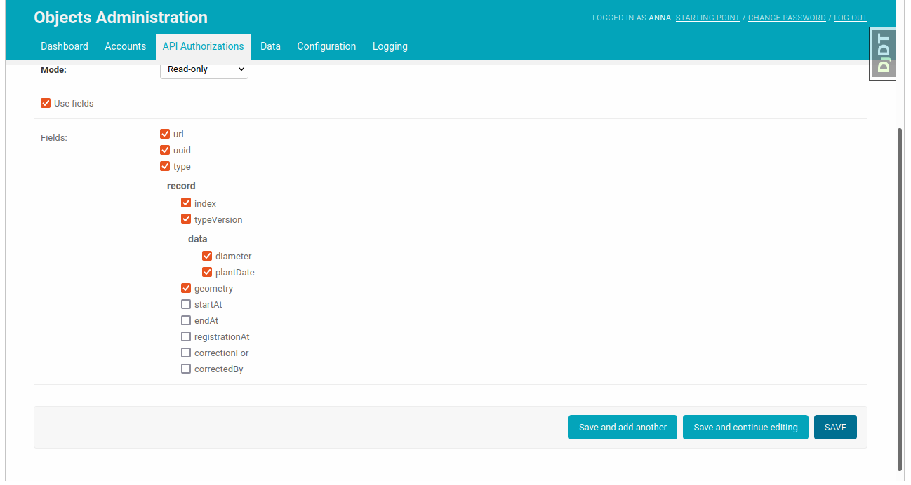

.. _admin_authorization:

=============
Authorization
=============

While :ref:`admin_authentication` is a process of verifying who a client is, authorization
is the process of verifying what they have access to. Authorization is usually
done after successful authentication.

Objecttypes API
===============

The Objecttypes API doesn't have a particular authorization model, i.e. every
authenticated client has access to all object types.

Objects API
===========

In the Objects API, clients have explicit access to objects based on their
object types. Permissions for particular object types can be configured in the
admin. In the example below we will create a permission to modify tree objects, i.e.
objects of "Boom" object type.

Access to Objecttypes API
-------------------------
Since the access to objects is based on their object types, the Objects API should have
credentials to communicate with the Objecttypes API.

In the admin page of the Objects API click on the "add" button for "Services"
resource.

.. image:: _assets/img/authorization_objects_service.png
    :alt: Fill in the form and click on "save" button

Fill in the form with the information about the Objecttypes API and put the Objecttypes API
created in the :ref:`admin_authentication` section of this document into "Header value" field.
If you use NLX you can configure it in the "NLX url" field. After the form is submitted
the Objects API can access the Objecttypes API since it now has a security token for it.

Add an object type
------------------

Now we can add an object type to the Objects API, to define permissions.

In the admin page of the Objects API click on the "add" button for "Object types"
resource.

Choose the service created in the previous step and fill in the uuid of the "Boom" object type.
After the form is submitted the object type name will be retrieved automatically from
the Objecttypes API.

Add a permission
----------------

Finally it's time to create a permission to access objects with "boom" object types.

In the admin page of the Objects API click on the "add" button for "Permission"
resource.

Select the token object created in the :ref:`admin_authentication` section, the object type
created in the previous step and the permission mode.

Checking the attribute "Use fields" turns on the field based authorization, i.e you can select
the particular list of fields of the object this token will have access to. The field-based
authorization is allowed only for "read-only" permission mode. After choosing the allowed
fields you can submit the form.

Now the client who has this token can access the objects with the "Boom" object type.

If you want to know how to use Objects API you can follow :ref:`api_usage`
