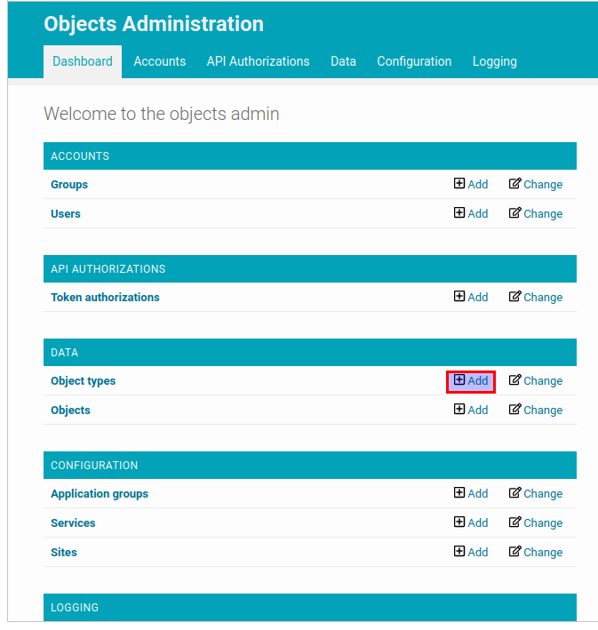
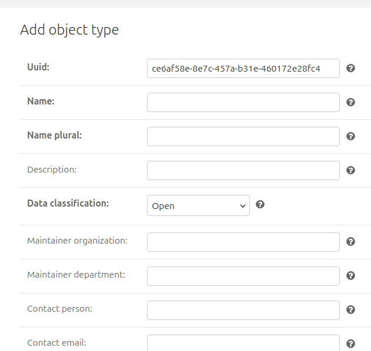
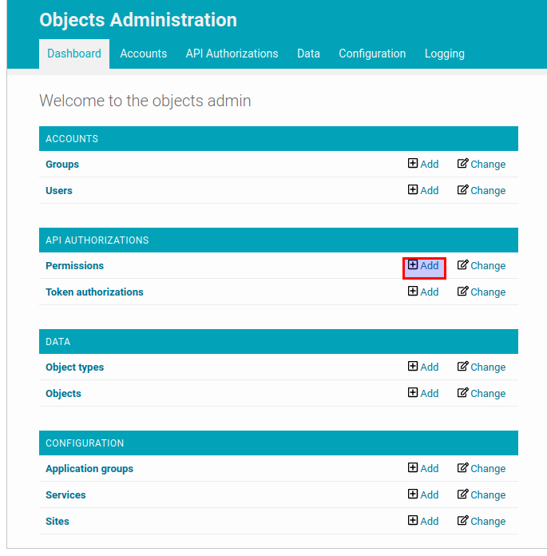
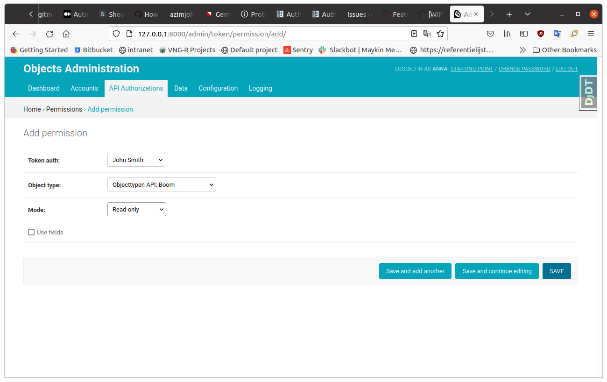
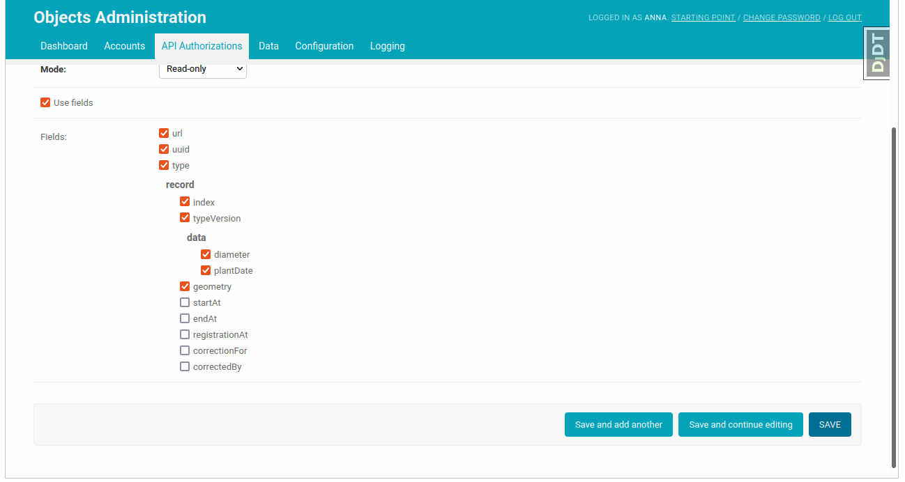

.. _admin_authorization:

=============
Authorization
=============

While :ref:`admin_authentication` is a process of verifying who a client is, authorization
is the process of verifying what they have access to. Authorization is usually
done after successful authentication.

Objecttypes
===========

For Objecttypes there is no a particular authorization model, i.e. every
authenticated client has access to all object types.

Objects
=======

For Objects, clients have explicit access to objects based on their
object types. Permissions for particular object types can be configured in the
admin. In the example below we will create a permission to modify tree objects, i.e.
objects of "Boom" object type.

Add an object type
------------------

Now we can add an object type to define permissions.

In the admin page click on the "add" button for "Object types"
resource.

Add a permission
----------------

Finally, it's time to create a permission to access objects with "boom" object types.

In the admin page click on the "Add" button for "Permission"
resource.

Select the token object created in the :ref:`admin_authentication` section, the object type
created in the previous step and the permission mode.

Checking the attribute "Use fields" turns on the field based authorization, i.e you can select
the particular list of fields of the object this token will have access to. The field-based
authorization is allowed only for "read-only" permission mode. After choosing the allowed
fields you can submit the form.

Now the client who has this token can access the objects with the "Boom" object type.

If you want to know how to use the API you can follow :ref:`api_usage`

Superuser permissions
----------------------

It's possible to set up superuser permissions in the API. A client with such permissions
is able to perform any operation on any object or objecttype.

In the admin page go to the "Token authorizations" resource and click on
a token, which should have superuser permissions. Check "is superuser" field. Now this token
has read and write permissions for all objects.

.. warning::

   Tokens with superuser permissions are not recommended for production. They should be used
   only for test and development purposes.
