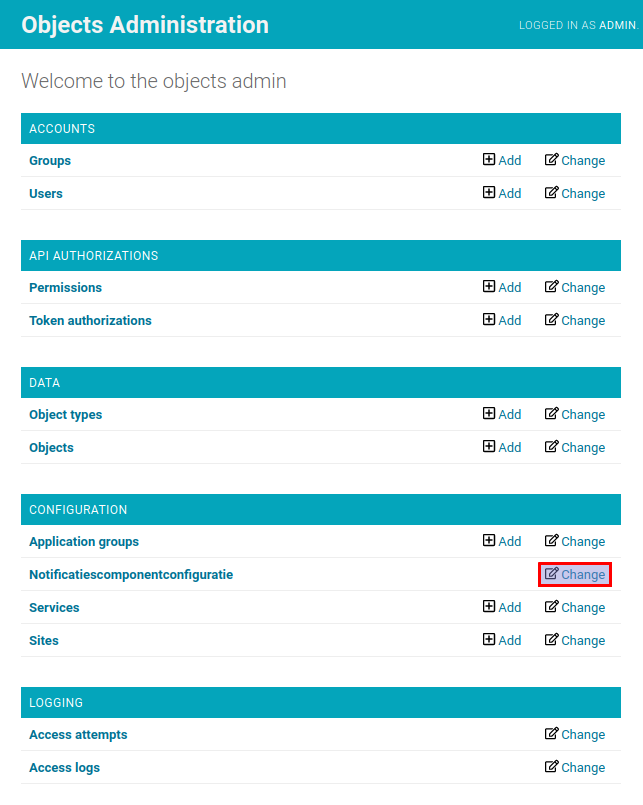
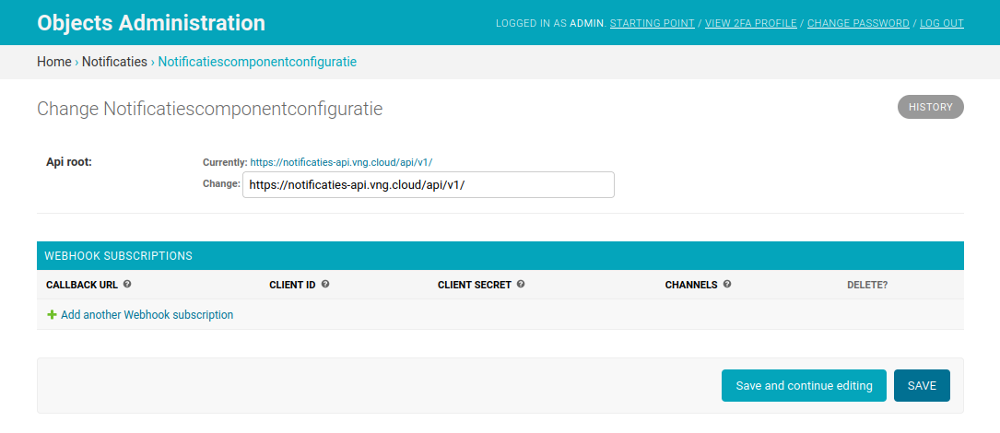
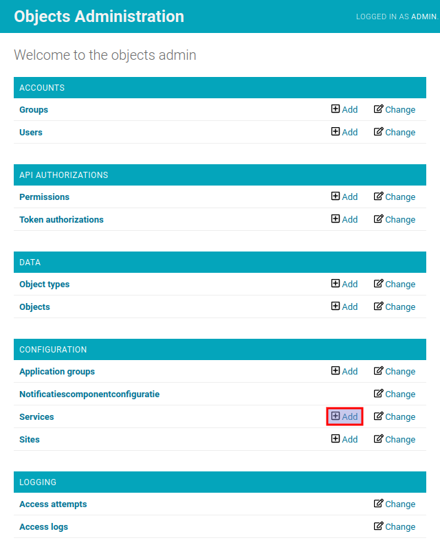

.. _admin_notifications:

=============
Notifications
=============

The Objects API can be configured to send notifications to a configured Notificaties API.
These notifications are sent whenever Objects are created, updated or deleted via the Objects API.
Other applications can subscribe to these notifications, for example to trigger
certain processes whenever an Object is created.

For more information on the Notificaties API, please refer to the `documentation`_.

Configuration
=============

In order to configure notifications, navigate to the admin page and click on the
"change" button next to "Notificatiescomponentconfiguratie", under the "Configuration" tab.

On the next page, fill in the correct API root of the Notificaties API to which
notifications must be sent and click on the "save" button afterwards.

Navigate back to the admin index page and click on the "add" button next to
"Services", under the "Configuration" tab.

On the "add service" page, fill in the following information:

1. **Label**: the name of the **Service**, i.e. ``Notificaties API``
2. **Type**: ``NRC (Notifications``
3. **Api root url**: the same URL as in the "Notificatiescomponentconfiguratie"
4. **Client ID**: a valid client ID to identify the Objects API (registered in Autorisaties API)
5. **Secret**: a secret corresponding to the client ID (registered in Autorisaties API)
6. **Authorization type**: ``ZGW client_id + secret``
7. **Header key** / **Header value**: leave empty
8. **OAS**: a URL pointing to the OpenAPI specification of the Notificaties API,
   the API root from step 2, followed by ``schema/openapi.yaml``
9. **Nlx url**: leave empty
10. **User ID**: a user ID to show in the audittrail
11. **User representation**: a human readable representation of this application
    to show in the audittrail

Finally, click on the "save" button.

.. image:: _assets/img/notifications_service_add.png
    :alt: Click on the "add" button next to "Services"

In order for this configuration to work, API authorizations must be configured
in an Autorisaties API. Open Zaak is an example of an application that implements this API.
For more information on how to configure API authorizations in Open Zaak,
please refer to the `Open Zaak authorization documentation`_.

For more information on how to set up subscriptions in Open Notificaties, please refer
to the `Open Notificaties subscription documentation`_.

.. _documentation: https://open-notificaties.readthedocs.io
.. _Open Zaak authorization documentation: https://open-zaak.readthedocs.io/en/stable/manual/api-authorizations.html
.. _Open Notificaties subscription documentation: https://open-notificaties.readthedocs.io/en/stable/manual/subscriptions.html
