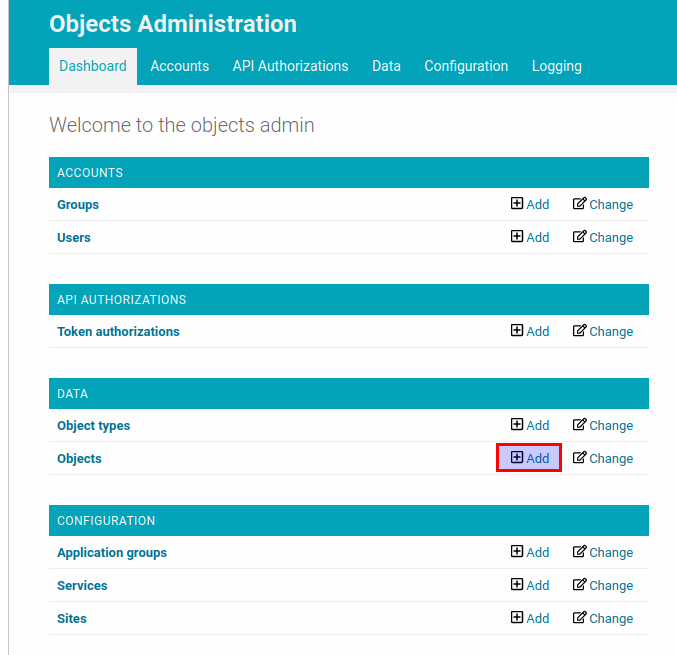
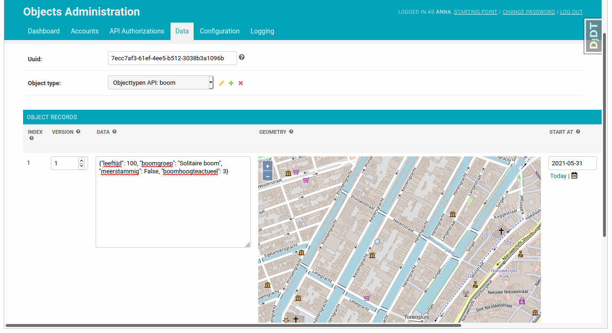
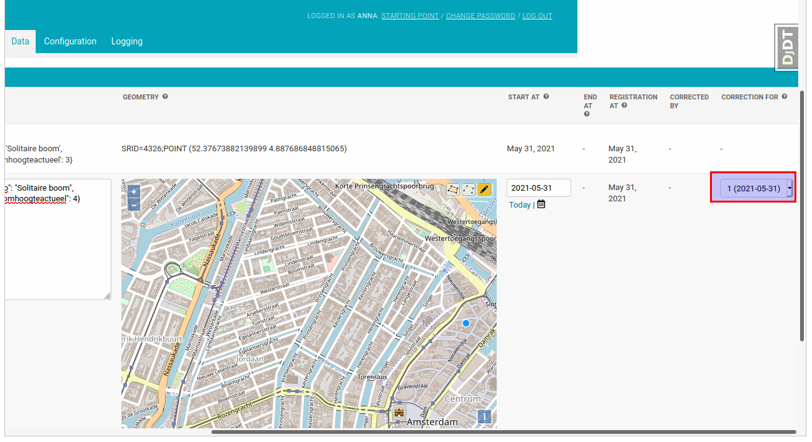

.. _admin_object:

=======
Objects
=======

Creating and updating objects are usually done using the Objects API. :ref:`api_usage`
describes how to do it in detail. But it's also possible to manage objects in the
admin interface. In this tutorial we will create and update objects using the Objects
admin.

Relate an object type
---------------------

Each object must belong to a particular object type created in the Objecttypes API.
The access to objects (the authorization) is also based on the related object types.
Therefore before creating the object we need to make the object type from the Objecttypes API
available in the admin interface of the Objects API. The section "Add an object type" of the
:ref:`admin_authorization` describes how to do it.

Create an object
----------------

Now we can create an object.  First, let's construct some tree data that matches our JSON schema
in the related object type:

.. code-block:: json

    {
        "boomgroep": "Solitaire boom",
        "boomhoogteactueel": 3,
        "leeftijd": 100,
        "meerstammig": false
    }

If you want, you can validate your JSON data against the JSON schema on `JSONschema.dev <https://jsonschema.dev>`_

In the admin page of the Objects API click on the "add" button for the "Objects"
resource.

Select the object type added on the previous step in the "Object type" dropdown and fill in all
the record data including JSON data, describing the tree object. "Version" is the version of the
related object type. Together with the "Object type" field it identifies which JSON schema
should be used to validate JSON in the "Data" field.

When you click on the "save" button the JSON data is validated against the JSON schema defined in the
related object type. If the data is valid the object will be created.

Add an object record
--------------------

Once the object record is created it can't be changed. If you want to change the data the new
record should be created. If the previous record contains incorrect information, it can be
corrected in the "Correction" field of the next record.

In the Objects API you always see one record, which contains data of a certain time (by default
the latest one). However in the admin interface you can see all the records created for the object.
