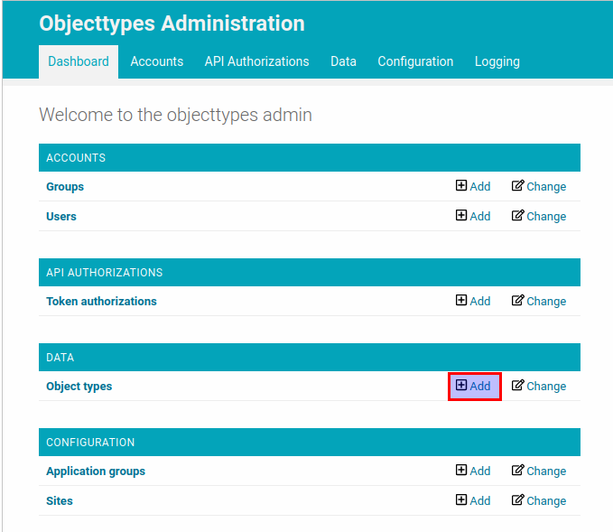
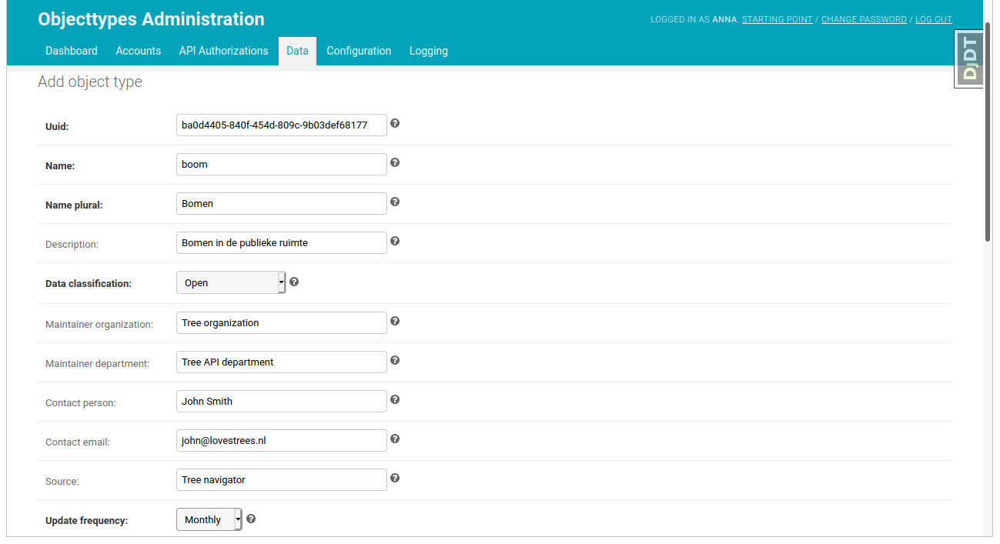
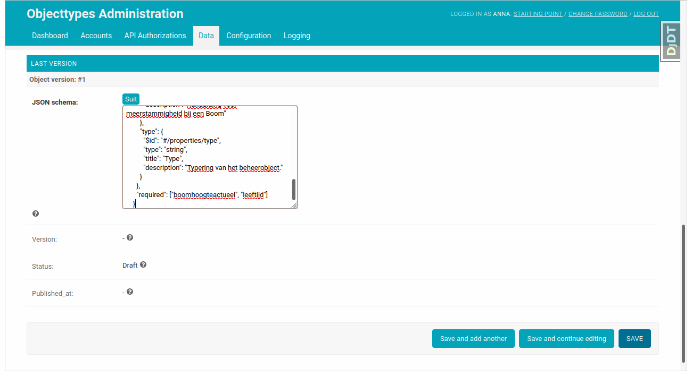
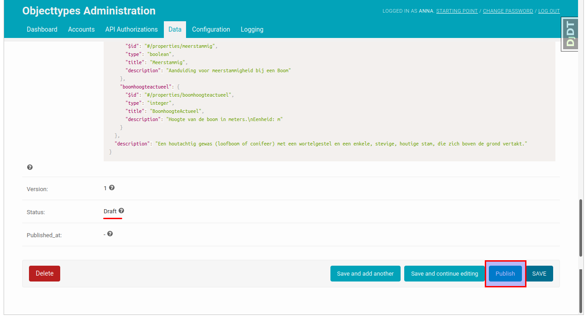
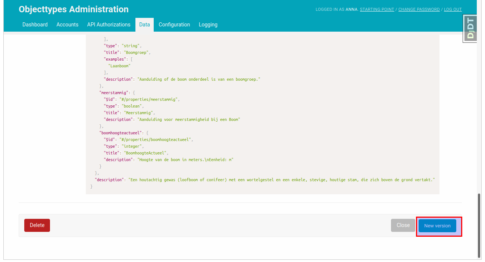
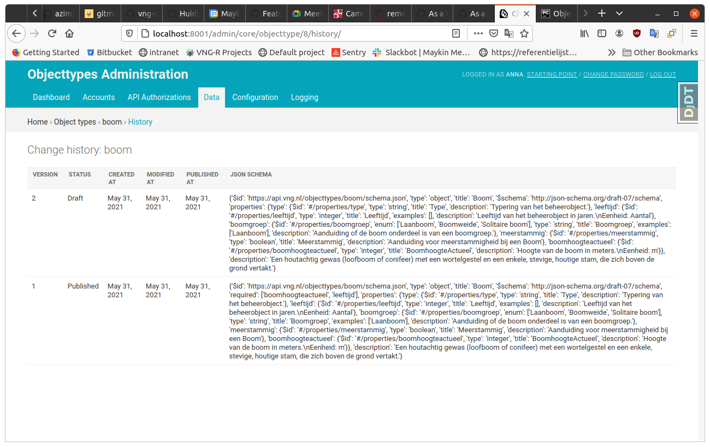

.. _admin_objecttype:

============
Object types
============

Creating and changing object types is typical tasks for the Objecttypes API.
:ref:`api_usage` describes how to do it with HTTP requests. But you can also
use the admin interface to create, publish and update object types.

Create an object type
---------------------

Let's start with creating an object type. For example, you want to store data
about trees in your town. First, you need to decide which attributes your data
will have and to design JSON schema for trees. You can take a look at provided
:ref:`examples_index`. In this example we will use the same JSON schema as in the
:ref:`api_usage` page.

.. code-block:: json

    {
      "$schema": "http://json-schema.org/draft-07/schema",
      "$id": "https://api.vng.nl/objecttypes/boom/schema.json",
      "type": "object",
      "title": "Boom",
      "description": "Een houtachtig gewas (loofboom of conifeer) met een wortelgestel en een enkele, stevige, houtige stam, die zich boven de grond vertakt.",
      "properties": {
        "boomgroep": {
          "$id": "#/properties/boomgroep",
          "type": "string",
          "title": "Boomgroep",
          "description": "Aanduiding of de boom onderdeel is van een boomgroep.",
          "examples": [
            "Laanboom"
          ],
          "enum": [
            "Laanboom",
            "Boomweide",
            "Solitaire boom"
          ]
        },
        "boomhoogteactueel": {
          "$id": "#/properties/boomhoogteactueel",
          "type": "integer",
          "title": "BoomhoogteActueel",
          "description": "Hoogte van de boom in meters.\nEenheid: m"
        },
        "leeftijd": {
          "$id": "#/properties/leeftijd",
          "type": "integer",
          "title": "Leeftijd",
          "description": "Leeftijd van het beheerobject in jaren.\nEenheid: Aantal",
          "examples": []
        },
        "meerstammig": {
          "$id": "#/properties/meerstammig",
          "type": "boolean",
          "title": "Meerstammig",
          "description": "Aanduiding voor meerstammigheid bij een Boom"
        },
        "type": {
          "$id": "#/properties/type",
          "type": "string",
          "title": "Type",
          "description": "Typering van het beheerobject."
        }
      },
      "required": ["boomhoogteactueel", "leeftijd"]
    }

In the admin page of the Objects API click on the "add" button for "Object types"
resource.

Fill in the form with the meta information about the object type. The ``uuid`` field is already prefilled in.

Scroll down, add the JSON schema in the "Last version" subsection and click on the "save" button.

The object type has been created.

Publish an object type version
------------------------------

Let's take a look at our freshly created object type. You can see that the object type has the 'draft'
status, which means, that it can be updated
without creating a new version. Once the object type version is published you can't change
it anymore, unless you create a new version.

Let's publish our object type version. It can be easily done with clicking on the "publish"
button.

Now the status of the "last version" is changed to "published" and the value of the "JSON schema"
attribute becomes read-only,

Create a new version
--------------------

After the object type version is published the only way to change the JSON schema is to create a new version.
You can do it by clicking on the "New version" button. The new version will have the same JSON schema as the
previous one. You can use it as initial value and edit it the way you want it.

In this example we remove the "required" attribute in the JSON schema and save it.

Display the version history
---------------------------

The versions are created to keep track on changes in the JSON schema. You can see all the previous changes
if you click on the "history" button in the top right corner of the object type admin page.

You can see all the versions, their statuses, the creation dates and the related JSON shemas.
