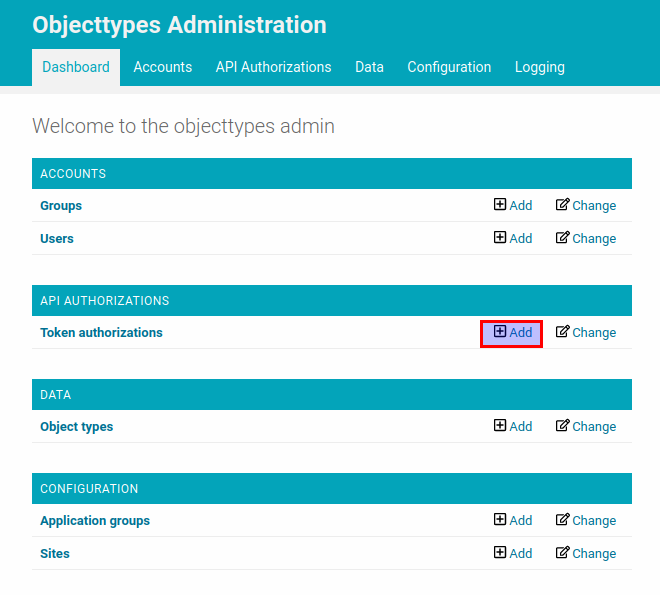
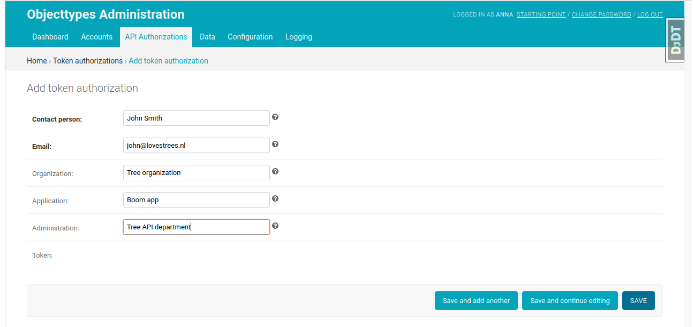

.. _api_authorization:

==============
Authentication
==============

Both Objecttypes API and Objects API support token authentication (or bearer authentication),
which means that everyone who has the security token can access the API. Tokens are
configured in the admin page.

Objecttypes API
===============

In this section we will create a security token for Objecttypes API and use it in
the HTTP request.

In the admin page of Objecttypes API click on the "add" button for "Token authorizations"
resource.

After the form is filled in and submitted the token would be created. The token
itself is a sequence of 40 letters and digits. It's value is generated automatically
when the form is submitted. In this example we will use ``1234`` as a token value.

Now we can use the created token to request Objecttypes API. The token should be
included into "Authorization" header: ``Authorization: Token 1234``

.. code-block:: http

    GET /api/v1/objecttypes HTTP/1.1
    Authorization: Token 1234

    HTTP/1.1 200 OK

    []

If you want to know how to use Objecttypes API you can follow :ref:`api_usage`

Objects API
===========

The creation of authentication token for Objects API is the same as for Objecttypes API.
In the admin page of Objects API click on the "add" button for "Token authorizations"
resource.

