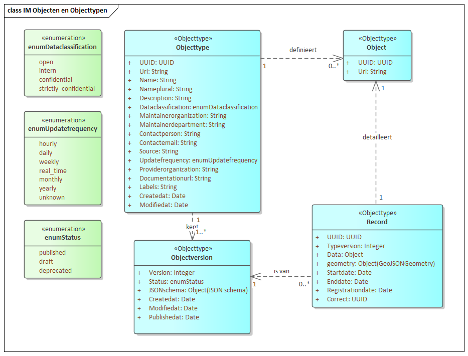

=================
Information model
=================

The Objects and Objecttypes APIs can be represented as an information model
(IM). The IM shows the relations between classes from both APIs and makes use
of the Dutch standard `Metamodel Informatiemodellering`_ (MIM).

An organization creates and **Objecttype**. The **Objecttype** contains various
meta data attributes and essentially describes the type of object and keeps
track of the administrative properties. An **Objecttype** has one or more
**ObjecttypeVersions**. Each **ObjecttypeVersion** has a version number and
contains the actual attributes - stored as JSON schema - that are needed to
represent an **Object** of this **Objecttype**.

Once an organization has an **Objecttype** with its first **ObjecttypeVersion**,
**Objects** can be stored. An **Object** is defined by an **Objecttype**. The
**Object** can change over time and these changes are reflected in **Records**.
An **Object** therefore always has one or more **Records** of a specific
**ObjecttypeVersion**.

History is modelled as described by the Dutch `StUF`_ standard for keeping both
formal and material history and allow for formal corrections over time, without
changing the material history.

Links
=====

* `Enterprise Architect (lite) <https://sparxsystems.com/products/ea/trial/request.html>`__
* :download:`Object and Objecttypes information model <_assets/information-model.zip>`
* `MIM-files <https://register.geostandaarden.nl/informatiemodel/mim/>`__

.. _`Metamodel Informatiemodellering`: https://www.geonovum.nl/geo-standaarden/metamodel-informatiemodellering-mim
.. _`StUF`: https://vng-realisatie.github.io/StUF-onderlaag/documenten/Stuf0301.pdf
