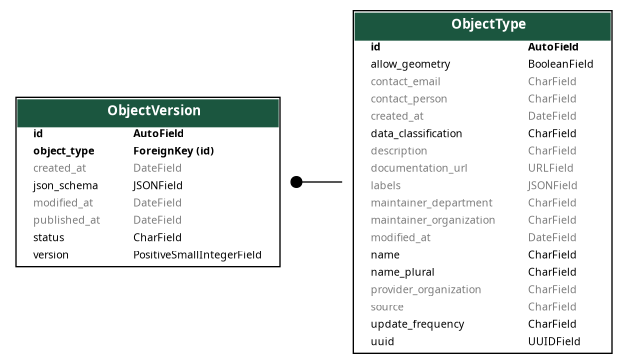

.. _uml_diagrams:

UML Diagrams
============

This section contains UML diagrams for resources per components.

.. note::

    These are the underlying data models and this shows the relationships between the resources,
    but not all attributes are the exact same as in the API.

Objects API
-----------
.. uml_images::
    :apps: core
    :excluded_models: Service

Objecttypes API
---------------

Core

