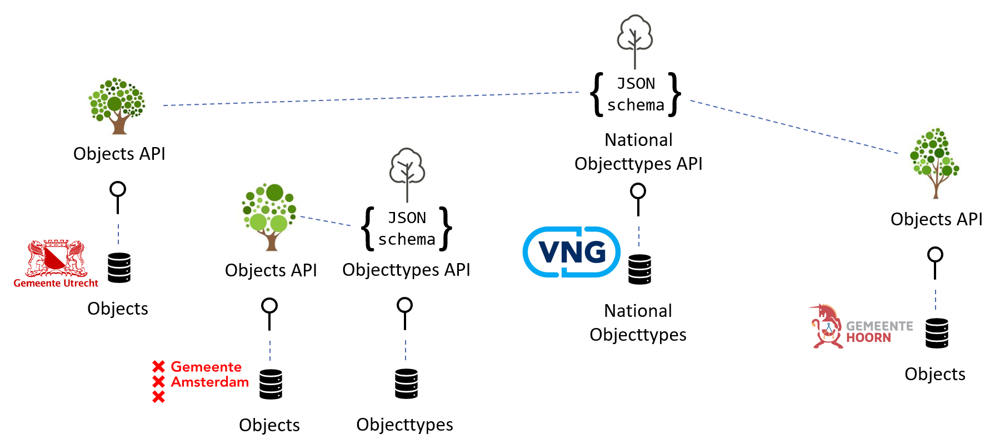

Visualization
=============

The Objectypes API works together with the Objects API, objects of a certain
objecttype. In the examples below, there is an *objecttype tree* that is 
considered the national definition. The objecttype is therefore present in the
national Objecttypes API, hosted by a public national organization, such as the 
VNG.

The municipality of Utrecht wants to store its trees according to the national
defintion and indicates that the trees in its Objects API follow the 
*objecttype tree* as provided in the Objecttypes API by VNG.

As soon as the municipality of Utrecht authorizes this, trees can immediately 
be stored in their Objects API.

.. image:: _assets/objects_api_and_objecttypes_api.png
    :width: 100%
    :alt: Municipality of Utrecht using its own Objects API to store trees according to the definitios from the VNG Objecttypes API.

Ofcourse, not only the municipality of Utrecht can do this. Many more 
organizations can do this and store the trees that are relevant for them 
according to this definition.

.. image:: _assets/multiple_objects_apis_using_national_objecttypes_api.png
    :width: 100%
    :alt: More organizations store their trees according to the national definition.

Every organization is free to decide which objecttypes to use but also, which 
Objecttypes API to use. It's fully supported to run your own Objecttypes API '
with your own objecttypes. This is usefull if you want to deviate from national
standards or simply want to use other objecttypes that are not available in the
national Objecttypes API.

In the case below, the municipality of Amsterdam decides to use their own 
objecttype of a tree. They run their own Objecttypes API with that specific
objecttype in it.

Eventually, the Objects API will contain objects of many different objecttypes
that can come from many different Objecttypes API.

.. image:: _assets/using_multiple_objecttypes_apis.png
    :width: 100%
    :alt: Mixing Objecttypes API in your Objects API

